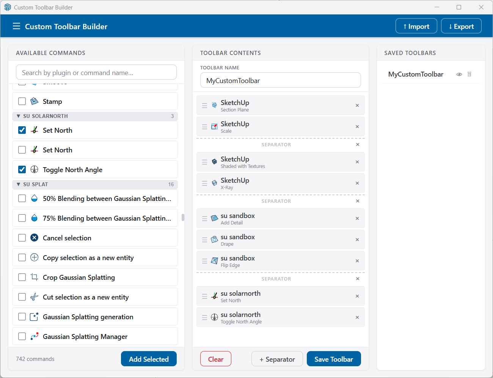

# Custom Toolbar Builder for SketchUp

A SketchUp extension that lets you build custom toolbars from buttons of any loaded extension. Similar to Fredo LordofToolbars but simpler and more focused.




## Features

- **Browse commands** from all loaded extensions, with icons and plugin names
- **Search** by command name, tooltip, or plugin/source name
- **Icons displayed** in both the available list and the selected list; commands without icons show a neutral default icon
- **Drag-and-drop reorder** selected commands with a visual drop-indicator between items
- **Separators** — insert visual group separators between toolbar buttons via the *+ Separator* button
- **Multiple toolbars** — create as many custom toolbars as needed
- **Persistent** — toolbars are saved to a JSON file and restored automatically on SketchUp startup
- **Import/Export** — share toolbar configurations as JSON files

## Installation

1. Copy the `src/` contents to your SketchUp Plugins directory:
   - Windows: `%APPDATA%\SketchUp\SketchUp 2024\SketchUp\Plugins\`
   - Mac: `~/Library/Application Support/SketchUp 2024/SketchUp/Plugins/`

2. Restart SketchUp

3. The extension appears under **Extensions > Yoo Custom Toolbar**

## Usage

### Building a Custom Toolbar

1. Go to **Extensions > Yoo Custom Toolbar > Build Custom Toolbar...**
2. Browse or search the **Available Commands** panel on the left
3. Check commands to select them, then click **Add Selected**
4. Optionally click **+ Separator** to insert a separator at the current end of the list
5. Drag items up or down to reorder — a blue line shows where the item will land
6. Enter a name in the **Toolbar Name** field
7. Click **Save Toolbar**

Your custom toolbar appears in SketchUp immediately and is restored on every startup.

### Managing Toolbars

- **Edit**: Click a saved toolbar name to reload it into the builder
- **Delete**: Click the trash icon to remove a toolbar

### Import/Export

- **Export**: Saves all toolbar configurations to a JSON file
- **Import**: Loads configurations from a JSON file

Access via **Extensions > Yoo Custom Toolbar** menu or the Import/Export buttons in the dialog.

## How It Works

**Command discovery** — on opening the builder the extension:
1. Scans `ObjectSpace` for all live `UI::Command` instances
2. Augments with commands from known extension modules
3. Deduplicates by Ruby `object_id` so commands with identical names from different plugins are all listed separately

**Command display** — each item shows:
- Plugin/source name as the primary (bold) title
- Command name as the secondary line
- The command's own icon, or a neutral default if none is set

**Toolbar restoration** — on startup:
1. First tries to match saved commands by `object_id` (same session)
2. Falls back to fuzzy matching by tooltip or icon filename (cross-session)
3. Creates a placeholder button if the source extension is not loaded
4. Assigns the default icon to any button that has no icon

## File Structure

```
Yoo_CustomToolbar/
├── src/
│   ├── Yoo_CustomToolbar.rb              # Extension entry point
│   ├── icons/
│   │   ├── toolbar_builder.svg           # Builder button icon
│   │   └── default_command.svg           # Fallback icon for iconless commands
│   └── yoo_custom_toolbar/
│       ├── main.rb                        # Loads extension, restores toolbars
│       ├── command_scanner.rb             # Discovers and deduplicates commands
│       ├── toolbar_manager.rb             # Creates/restores UI::Toolbar instances
│       ├── settings_store.rb              # File-based JSON persistence & import/export
│       └── toolbar_builder_dialog.rb      # HtmlDialog UI (HTML/CSS/JS embedded)
└── README.md
```

## Configuration Format

Toolbar configs are stored in:
`%APPDATA%\SketchUp\SketchUp 2024\SketchUp\Plugins\yoo_custom_toolbar_data\toolbars.json`

Exported JSON files have this structure:

```json
{
  "version": 1,
  "exported_at": "2026-01-15T10:30:00Z",
  "toolbars": [
    {
      "name": "My Custom Toolbar",
      "commands": [
        {
          "id": "abc123",
          "command_ref": "70234567890",
          "name": "BOQ Manager",
          "tooltip": "Open BOQ Manager",
          "icon_path": "/path/to/icon.svg",
          "source_toolbar": "Yoo Estimator"
        },
        {
          "id": "__separator__",
          "is_separator": true
        }
      ]
    }
  ]
}
```

## Limitations

- Commands are discovered from currently loaded extensions only
- Some extensions may not expose their commands detectably
- SketchUp API does not support destroying toolbars — deleted toolbars are hidden only
- Icon paths are absolute; portability between machines requires re-saving the toolbar

## License

MIT License — see [LICENSE](LICENSE) for details.

Copyright (c) 2026 Jure Judez
